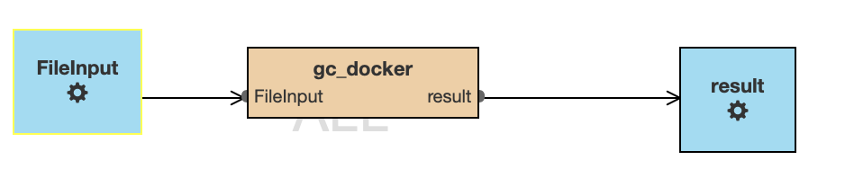
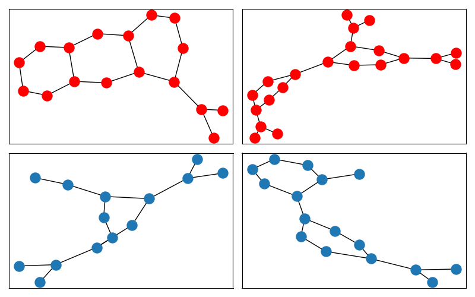
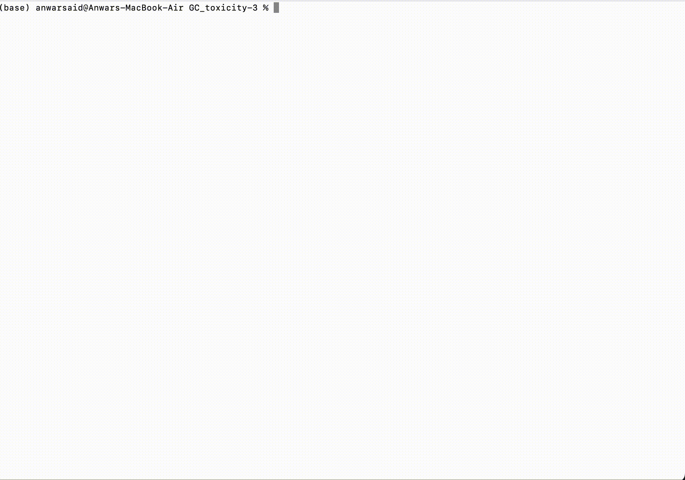

The examples collection of the CWL Design Studio
========================================

The goal
________

The goal of this collection is to provide additional
examples that new users can leverage for the early
learning of the features and how-to's of this
visual modeling environment. In contrary to the 
tutorials and how-to descriptions, these examples
will not focus on the process of the model creation,
rather they will focus on different (real-life) 
scenarios where the use of CWL models gives a boost
to productivity.

Example 1: Building graph classification workflow
==============================================

Problem statement
________

The main goal of this workflow is to provide a graph machine learning framework which predicts the probability of a given compound’s toxicity provided in the form of a graph. This problem setting falls under the well-known task of graph classification. 

Model Input, Output
_____________

The model input comprises a collection of graphs and their corresponding label set, which are structured within a dictionary container with the keys 'graphs' and 'labels'. This dictionary is then serialized in a pickle format. The graphs themselves are represented in Networkx format. The model returns the performance in terms of accuracy and write it to a csv file. 

Graph Classification
________________

The graph classification framework consists of two stages, namely (a) graph representation generation, and (b) training of a Random Forest classifier on those generated representations. For the first step, we utilize the newly proposed Distributed Graph Descriptor (DGSD)[1], and NetLSD [2]. DGSD leverages a pair-wise distances approach for computing distances among all pairs of nodes within a given graph. The resulting distance matrix is then used to generate histograms, which serve as the graph representation. NetLSD uses spectral graph properties to generate graph representations. Once these representations have been computed using one of the above descriptor (NetLSD by default), a Random Forest classifier is trained to make predictions based on the generated features. We would like to note that this workflow can be easily updated to incorporate any other graph machine learning approaches such as graph neural networks and graph kernels. 

To summarize, this workflow comprises of three components: input (pickle file), a model (docker image) and output as a csv file. Considering these three components, we define our workflow detailed below. 

Implementation details
________________

The implementation uses publicly available netlsd and dgsd python packages, scikit-learn and networkx. The package has been streamlined to main.py, requirement.txt and a dockerfile. The docker image can be created with “gc_docker:latest” id as follows.

.. code-block::dos

docker build -t gc_docker:latest .

Create workflow model
______________________________

To understand the basic of the workflow, we refer the reader to  :ref:`domain intro section <The Common Workflow Language modeling language>`

To begin, we'll create a new workflow project using a simple drag-and-drop technique from the partBrowsers to the composition screen. We'll provide a name and context to help us keep everything organized.

Since we have three main components - input, model, and output - we'll start by creating a FileInput component and naming it "file". Similarly, we'll create a DockerFile component and name it "Gc_toxicity" as our second component. We'll set the command arguments to "python main.py", the image ID to "gc_docker:latest", and we'll name it "gc_docker". We'll also set the working directory to "/app".

Finally, we'll create a FileOutput component and name it "results". Under the Docker image component, we'll create FileInput and FileOutput components to indicate input, output to the model. Then we’ll connect the FileInput component to gc_docker and the gc_docker component to the results FileOutput component. The final workflow should look like as follows. 

   
Input - sample graphs
_________________

The following figure shows four sample graphs that were used as part of the input for the model. These graphs were obtained from the MUTAG dataset, which is a benchmark for graph classification. The graphs with red nodes are labelled as toxic, while the ones with blue nodes are labelled as non-toxic.

Workflow Execution
____________________________________
 

To commence with the workflow execution process, the initial step would entail building and downloading the workflow onto the local machine. Subsequently, the data folder can be downloaded from the `source <https://github.com/webgme/webgme-cwl/tree/master/docs/Examples/GraphML_workflow>` and placed within the downloaded “GC_toxicity” workflow.  Once the data folder is placed and all dependencies has been met, the following command may be invoked to launch the workflow. 

.. code-block::dos
cwltool --no-match-user --no-read-only --tmpdir $PWD --preserve-environment LEAP_CLI_DIR GC_toxicity.cwl.json --FileInput data/dataset.pkl

In the following, we show the execution of the workflow on local machine. 

