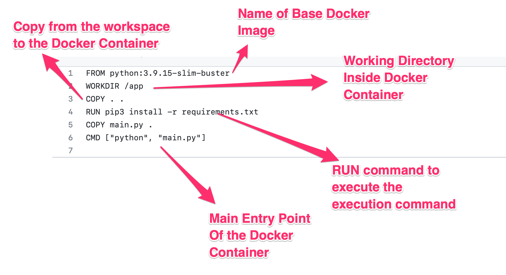

The examples collection of the CWL Design Studio
===========================================================
The goal of this collection is to provide additional
examples that new users can leverage for the early
learning of the features and how-to's of this
visual modeling environment. In contrary to the 
tutorials and how-to descriptions, these examples
will not focus on the process of the model creation,
rather they will focus on different (real-life) 
scenarios where the use of CWL models gives a boost
to productivity.

Building a graph classification workflow example
===============================================================
Problem statement
______________________
The main goal of this workflow is to provide a graph machine learning framework which predicts the probability of a given compound’s toxicity provided in the form of a graph. This problem setting falls under the well-known task of graph classification. 

Model Input, Output
___________________________

The model input comprises a collection of graphs and their corresponding label set, which are structured within a dictionary container with the keys 'graphs' and 'labels'. This dictionary is then serialized in a pickle format. The graphs themselves are represented in Networkx format. The model returns the performance in terms of accuracy and write it to a csv file. 

Graph Classification
__________________________

The graph classification framework consists of two stages, namely (a) graph representation generation, and (b) training of a Random Forest classifier on those generated representations. For the first step, we utilize the newly proposed Distributed Graph Descriptor (DGSD)[1], and NetLSD [2]. DGSD leverages a pair-wise distances approach for computing distances among all pairs of nodes within a given graph. The resulting distance matrix is then used to generate histograms, which serve as the graph representation. NetLSD uses spectral graph properties to generate graph representations. Once these representations have been computed using one of the above descriptor (NetLSD by default), a Random Forest classifier is trained to make predictions based on the generated features. We would like to note that this workflow can be easily updated to incorporate any other graph machine learning approaches such as graph neural networks and graph kernels. 

To summarize, this workflow comprises of three components: input (pickle file), a model (docker image) and output as a csv file. Considering these three components, we define our workflow detailed below. 

Implementation details and dockerization
___________________________________________

The implementation uses publicly available netlsd and dgsd python packages, scikit-learn and networkx. The package has been streamlined to main.py, requirement.txt and a dockerfile. 

To create the docker image, "requirment.txt" and dockerfile are necessary. The "requirement.txt" file should list all of the Python packages necessary to execute the project. We present an example of the requirement file that has been produced for this project below.

.. code-block:: python

   networkx
   numpy
   scikit-learn
   netlsd
   dgsd
To create the dockerfile, the following template can be used.

Once the requirements and dockerfile have been created, the following command can be executed to build the docker. 

.. code-block:: bash

   docker build -t gc_docker:latest .

Before building the docker, make sure to change your console to the project directory "GraphML_workflow". Once the docker has been built, next we would like to upload the docker image to the docker hub. To do this, we will login to the docker hub first and then will upload the image. Use the following commands to login and upload the image to the docker hub. 

.. code-block:: bash

   docker login -u <your_docker_id> --password <your_docker_password>
   docker push gc_docker:latest

Create workflow model
______________________________

To understand the basics of the workflow, we refer the reader to  :ref:`domain intro section <The Common Workflow Language modeling language>`

To begin, we'll create a new workflow project using a simple drag-and-drop technique from the partBrowsers to the composition screen. We'll provide a name and context to help us keep everything organized.

Since we have three main components - input, model, and output - we'll start by creating a FileInput component and naming it "file". Similarly, we'll create a DockerFile component and name it "Gc_toxicity" as our second component. We'll set the command arguments to "python main.py", the image ID to "gc_docker:latest", and we'll name it "gc_docker". We'll also set the working directory to "/app".

Finally, we'll create a FileOutput component and name it "results". Under the Docker image component, we'll create FileInput and FileOutput components to indicate input, output to the model. Then we’ll connect the FileInput component to gc_docker and the gc_docker component to the results FileOutput component. The final workflow should look like as follows. 

.. figure:: gc_toxicity_cwl.png
   :align: center
   :figwidth: 80%
   
Input - sample graphs
__________________________

The following figure shows four sample graphs that were used as part of the input for the model. These graphs were obtained from the MUTAG dataset, which is a benchmark for graph classification. The graphs with red nodes are labelled as toxic, while the ones with blue nodes are labelled as non-toxic.

.. figure:: examples.png
   :align: center
   :figwidth: 80%

Workflow Execution
____________________________________
 

To commence with the workflow execution process, the initial step would entail building and downloading the workflow onto the local machine. Subsequently, the data folder can be downloaded from the `source <https://github.com/webgme/webgme-cwl/tree/master/examples/GraphML_workflow>`_ and placed within the downloaded “GC_toxicity” workflow.  Once the data folder is placed and all dependencies has been met, the following command may be invoked to launch the workflow. 

.. code-block:: bash

   cwltool --no-match-user --no-read-only --tmpdir $PWD --preserve-environment LEAP_CLI_DIR GC_toxicity.cwl.json --FileInput data/dataset.pkl

In the following, we show the execution of the workflow on local machine. 

.. figure:: execution.gif
   :align: center
   :figwidth: 80%

You can find this example either in its own `repository <https://github.com/Anwar-Said/Graph_classification_cwl_example->`_ or among other examples
in the codebase of the `design studio <https://github.com/webgme/webgme-cwl/tree/master/examples/GraphML_workflow>`_.

[1]. `Anwar Said, et al. "DGSD: Distributed graph representation via graph statistical properties." Future Generation Computer Systems 119 (2021): 166-175 <https://www.sciencedirect.com/science/article/pii/S0167739X21000571?casa_token=ICH0PA1ch3EAAAAA:qXYRK5oOEH8irGnKczcs3UDh1nnlgKtyKeDCyd65IKd1UGcqgBbGPoeS52wlRhBYowwNwG1m>`_

[2]. `Anton, Tsitsulin, et al. Netlsd: hearing the shape of a graph. Proceedings of the 24th ACM SIGKDD International Conference on Knowledge Discovery & Data Mining. 2018. <https://dl.acm.org/doi/abs/10.1145/3219819.3219991?casa_token=Fs34Ggee8E4AAAAA:oycODo6pu8y3PrwiUj9bD-uXI8uJ54_s1t4gcBhJb5uOK8ztjcdhwXcSZsUmwLJlX1jLZrHJszMH>`_