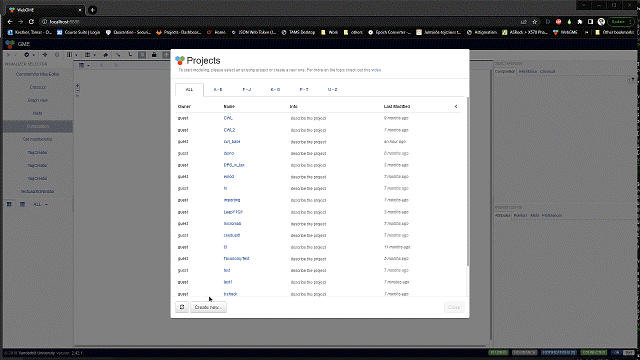
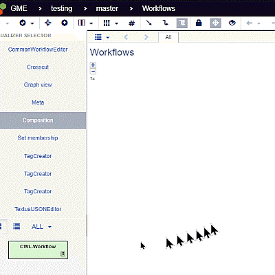
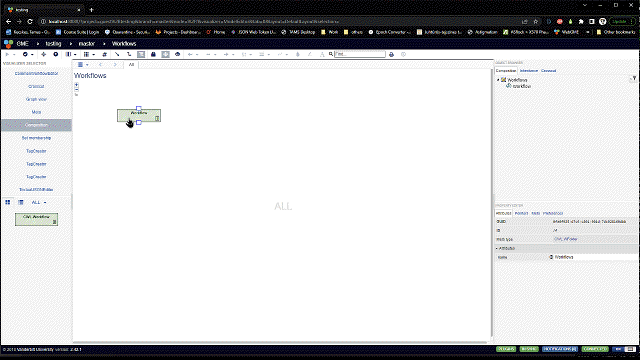
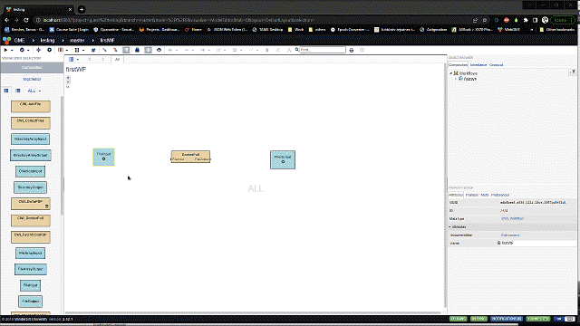
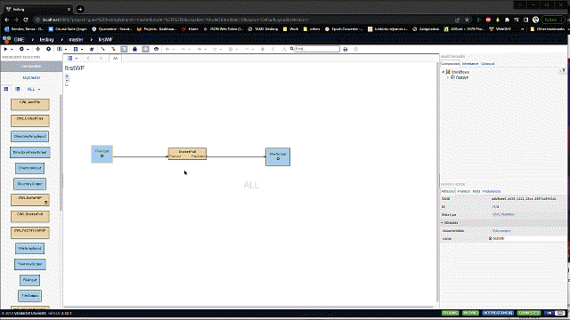

How to create CWL models - the basics
==============================================

The goal
________

The following how-to documentation is aimed to describe the basic steps
of creating and using a CWL model in the design studio. It is going to assume
that the user has a basic understanding of the WebGME concepts - check either the 
`wiki pages <https://github.com/webgme/webgme/wiki>`_ or the
`youtube videos <https://www.youtube.com/@webgme6963/videos>`_ (with special attention
to the `basics of modeling <https://www.youtube.com/watch?v=YKi_256Vy_0>`_ example).

Create workflow model
______________________________

As we have described in the :ref: `The Common Workflow Language modeling language` section
there are essentially only a few building blocks when you manipulate a workflow. However,
to aim for absolute clarity and guide our users in the process (who might not be experienced
in WebGME based Design Studio usage), here we provide a start to finish description
of workflow model creation.

At first, the user is welcomed with a create project dialog, where we suggest to pick
the default 'cwl_base' seed as a starting point of the work and pick a unique name for the
project. While each project in the CWL Design Studio can hold multiple workflows (and we
will describe how to export and import workflows into a project), for the sake of simplicity
we will stick to the one project one workflow rule.

   
   Creating an empty workflow project in the Design Studio

Once the project is created, we are welcomed with an empty *Workflows* folder where our 
initial action must be the creation of a Workflow that can be done with a simple drag and
drop operation using the *Part Bworser* (bottom left sidebar section with the list of 
available elements and their visual depiction). This drag and drop operation will be used
for all further element creation so we are not going to described them in detail but 
expect the user to follow this one with the apropriate element.

   
   Components of the Workflow or the workflow itself can be created by
   drag-and-drop from the *Part Browser*

With our new workflow, the first steps should be to name it and to enter into this 
new context so that we can create the parts of the workflow.

   
   Setting your workflow's name and entering its context for start building.

Adding and editing components
______________________________

When you add your components which falls into the category of either input, 
output, or step/sub-workflow, you just follow the drag and drop method using
the *Part Browser*. Once your component is on the screen the main editing and
configuration happens on the bottom right sidebar of the screen called the
*Property Editor*. While detailed description on how to configure your elements 
can be found in the :ref:`Steps section<Steps>`, we describe a few key principles 
here.

- Subworkflows are just like regular workflows can have any type of component, 
  which means that the hirearchical composition of workfows can go into any depths. 
  The simplest way to reuse a workflow inside another one is doen by copying as the 
  :ref:`Hello World example section<The Hello World of the CWL Design Studio>` 
  details it.

Defining the flow 
_________________

Once all the inputs outputs and steps are in place, you need to define
the flow of information. This can be done by connecting elements in a directed 
manner - starting from the source and ending on the target. The method is simple: 
hover with your mouse over the source element and push down the left mouse button 
over the connection box (the square that popped up when you moved your mouse over 
the box). This is how you start your connection. Once a connection started, all 
potential targets will show at least one connection box. Move your mouse over 
your intended target - if your intended target does not show a connection box, 
that means the two are not compatible so you need to double-check their types - 
and only release the mouse button over the target's connection box. If everything 
goes well, a connection line will appear and your workflow is one step closer 
to being finished. Ultimately you want a *path* from your inputs to your outputs 
but at the moment, there is no automated check for that, so the generated 
artifacts might not function or do not actually generate the required output.

   
   Flow creation that will define the sequence of steps and ultimately show 
   how the resulting outputs will be generated.

Generating and downloading CWL package
______________________________________

Once your workflow is complete and configured - ready to test/execute - you
are going to need all the CWL artifacts to do that. To do that all you need 
is a so called *Plugin execution* (in our case the *BuildWorkflow*). While
being at the workflow's context, bring your mouse to the toolbar and click
on the first button (|play_icon|) and from the dropdown list, select the 
*BuildWorkflow*. In the config pop-up window, just click on *Run...* and
wait for the result. Multiple notifiction will let you know once things
are ready - like a popup notification with a quick link to bring up the 
result window - and then you can once again go and click the |play_icon|
but this time select the *Show results...* option. From the results window
click on the artifact that is named just like your workflow. This will start
the download of all the artifacts you will need to execute and the README.md 
file will give you instructions and details of your workflow execution.

   
   Building your workflow and downloading the result.
