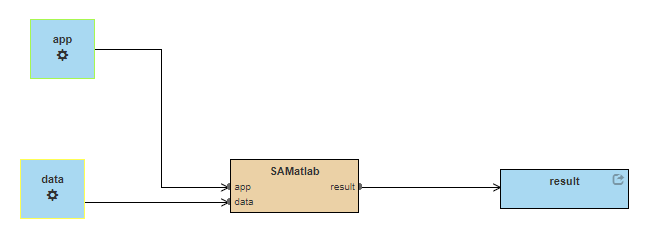
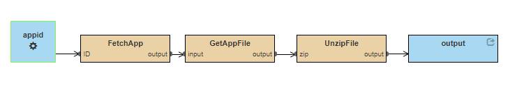
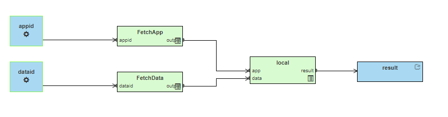

How to build workflow with remote data access
=============================================
The following short design guide will try to enhance the
user experience when it comes to portability and reusability 
of workflow models and the generated workflow artifacts.

In short
_______________
#. Build your workflow preparing it to run completely locally, 
meaning all inputation will be done from your file system.
#. Secondly build a workflow for every remote data download 
(and protentially its prehandling).
#. Finally create a composite workflow that will have the previous 
workflows as sub-workflows and automate the process end-to-end 
grabbing the input from remote source.

1. Initial computation build
_____________________________

Follow our :ref:`examples<The examples collection of the CWL Design Studio>` or :ref:`hello world<The Hello World of the CWL Design Studio>` tutorial and create a workflow 
that wraps your computation. It is easier to start by creating it in 
a manner that expects your inputs to exists locally. When finished 
modeling, build the workflow and execute it to verify if it produces 
the required outputs.

   
   The initial workflow that wraps the computation using local inputs.

2. Remote data workflow
_________________________
As our use-case involves data that should be used from a remote source. 
Our next step is going to be to create a separate workflow that only 
takes care about fetching that data and potentially pre-processing it. 
Do not forget to test this workflow separately to ensure that the default 
data references are correct and that the format of the data is exactly 
what expected by the computational part.

   
   Workflow that takes care of fetching remote data or code.

3. Combine the ingredients
_____________________________
The final step is to combine all pieces into a 'super workflow' that 
embeds the previous ones and provides and end-to-end functionality. 
Just create an empty workflow, add the inputs of the remote workflows 
and any remaining local data. Then copy the fetching workflows into 
this workflow. Now copy the computational workflow into this workflow 
and source its inputs from the outputs of the fetch sub-workflows. 
Finally add the necessary or used outputs to the level of this workflow 
and source them from the output of the computational workflow.

   
   The final end-to-end workflow combining data fetching and computation.

Why?
________ 
Designing your workflows this way will allow a better portability of 
the generated CWL artifacts. Design Studio will generate two important 
artifact: the **run.sh** and the **README.md**_. The script will cover the cwltool 
execution for the end-to-end scenario using the defautl values for the 
inputs. Meanwhile, the markdown file will have example cli commands for 
the subworkflows as well. This allows a better reuse, as it allows the 
user to only execute the subworkflows (doing local development again 
for example).