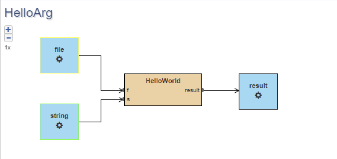

The Hello World of the CWL Design Studio
========================================

The goal
________

The aim of this hello world example is as all
such examples is to introduce a comprehensive yet 
easy to build example for the user exemplifying the 
main use-case of the whole design studio.

This is an end-to-end example in the sense that it starts
shortly describing how the dockerization of scripts should go 
and ending with noting the execution of a composed workflow 
using the standrard implementation of the CWL framework 
`cwltool <https://github.com/common-workflow-language/cwltool>`_ 
. All necessary files can be found in our
`repository <https://github.com/webgme/webgme-cwl/tree/master/tutorials/hello>`_ 
. The hello world will follow the docerization of a few arbitrary, though 
simple script - in our case written in javascript - then show different ways 
how they might get called in a workflow step. This way we aim cover the 
most essential issues that new users might face when they try to wrap their 
work in a workflow.

The environment
_______________ 

To be able to successfully complete the example, your computer needs a few 
software to be installed - we will not discuss the deployment of the Design 
Studio (DS) itself as we write our example from the perspective of the end-user 
of the DS. So, to run the built workflow of this example, you are going to need:

- `docker <https://www.docker.com/>`_
- `cwltool <https://github.com/common-workflow-language/cwltool#install>`_

Dockerize your computation 
___________________________ 

Before we can begin to model any simple or complex workflows, we need to ensure 
that our computational portions are dockerized to ensure maximum compatibility 
and portability. While techincally CWL can compose commands of the hosting system 
it would require tedious preparation of execution environment if we were to 
allow that.

Wrapping your work in a docker environment can be hard and is most probably unique 
as each compute process is unique. That means we cannot provide a step-by-step 
guide on how to do it, but there are sources that most probably will help get 
this part of the job done:

- `MatLab <https://www.mathworks.com/help/compiler/package-matlab-standalone-applications-into-docker-images.html>`_
- `Python <https://www.docker.com/blog/containerized-python-development-part-1/>`_
- `Javascript <https://docs.docker.com/get-started/02_our_app/>`_

In addition to these guides, here are a few key idea that you should 
follow to achieve maximal portability and reproducability with your work:

- fixed versions: Starting with the base image, always try to use fixed 
versions of software when you build your dockerfile allowing for exact 
re-execution later. This also means that you should avoid using generic 
update and upgrade commands as part of your description as they will 
not guarantee to keep all your packages on a certain version.
- use image instead of dockerfile: While the dockerfile is certainly 
more portable than the full docker image, sometimes it is just impossible 
to describe your environment in a text file, as you reached the 
perfect balance by a manual tweaking of your container. Sharing the 
image will also ensure that the versions remain the same.
- avoid licences: In general, you should handle your computing 
images as public, but there are certain situations when it is not possible. 
For sensitive images, the best approach is to generate an image, share 
it, and then use the step with the dockerImageId, That way the framework 
will not try to fetch it from the docker hub, but it will expect that 
the hosting machine has it. This way of using containers will also be 
preferred over the dockerfile as using a dockerfile would mean that 
the image will be rebuilt at each execution of the workflow.

Back to our example, you can find the *hello.dockerfile* among the 
artifacts. Just build it with ``docker build -f hello.dockerfile -t cwl:hello`` 
command. You can ensure you have the image by running a ``docker images`` 
command once the build finishes.

Passing arguments by name
_________________________ 

Probably the most versatile way for a computational element or command 
to accept arguments is by passing them as named arguments. To show this we 
are going to build a workflow that is going to call our image and pass a 
string and a file arguments by name.

First, let us create a workflow project using what we learned in the 
:ref:`cwl modeling basics <How to create CWL models - the basics>`. 
Using the drag-and-drop technique form the *PartBrowser* to the 
*Composition* screen, we create a workflow, name it *HelloArg* and then 
enter its context. On this level we first need our inputs and output. So 
let us create a **FileInput** and name it *file*, and a **StringInput** with the 
name *string*. As for our output, let us grab a **FileOutput** and name 
it simply *result*. As a last component on this level, let us grab a 
**DockerImage** step and name it *HelloWorld*. In addition, we are going to 
set the *command* attribute to **'node arg.js'**, the *imageId* to 
**'cwl:hello'**, and the *workdir* to **'/app'**. With these the framework 
will execute the 'arg.js' in the '/app' directory inside the 'cwl:hello'
container with our arguments.

As we have all our components ready on the main level of the workflow 
we need to make sure that data makes its way to where it is going to be 
needed during execution. To allow us to create the flow in this workflow 
we need the necessarry ports on our singular step. To do this we need to 
enter the context of the *HelloWorld* step. Once inside the step, we again
use the drag-and-drop to create a **FileInput** named *f*, and a 
**StringInput** named *s* to follow the structure of our script (arg.js). We 
also need to set the *asArgument* attribute of both input to **true** . To 
complete the step, we create a **FileOutput** named *result* and we set 
its *pattern* attribute to **'output.txt'** so that the execution would 
be able to look for the resulting file.

Finally, we return to the main workflow's context to add our flow. We simply
create a flow from the *string* intput to the *s* port, another from the 
*file* input to the *f* port, and a final one from the *result* port 
to the *result* output.

   
   The first workflow that passes arguments by name.

Passing arguments by position
_____________________________ 

Another frequently used technique of passing arguments to 
a command or script is to pass them by position. To this end 
we are going to extend our project with another workflow, 
that represent exactly that.

We will start this workflow by copying our previous one. Using 
the *ObjectBrowser* locate the **HelloArg** and drag it onto the 
screen. Once dropped, select the **'Copy here'** option to duplicate 
the workflow. Then rename it to **HelloPos**. (another way to copy 
a complete workflow is to press down Ctrl and drag and drop its 
block on the Composition editor)

There are only a few difference between the two flavors of execution:

- set the *command* of the step should be set to **node pos.js**
- set the *position* attribute of the *f* port of the step to 3
- set the *position* attribute of the *s* port of the step to 2 
  (we use these positions as 0 and 1 are taken by *node* and *pos.js*)

Once these changes are made, our new workflow is ready for execution!

Fixed input parameters
______________________ 

As a final hello world example, we like to show how the configuration 
of modeling elements go when we expect the input to be named specifically 
and be placed in a specific directory. This workflow - let's call it 
*HelloDir* - is almost identical to the first example, but we lose the 
string input and we are going to use **DockerPull** step for our execution.

First, we create a new workflow - let's call it *HelloDir* - and add the 
file input and the file output on top of the **DockerPull** step instance. 
For the step we set **'node dir.js'** as *command*, **'kecso/cwl:hello'** 
as *image*, and **'/app'** as *workdir*. The input can be renamed to 
**file** while the output to **result** just like in the previous cases. 

Secondly, we setup the ports of the step the following way:

- create a *FileInput* with the name **'f'**, let's leave the 
  *asArgument* the default **'false'** value, and set the *location* to 
  **'input.txt'**
- create a *FileOutput* identical to the previous examples (naming it 
  **'result'** and setting the *pattern* to **'output.txt'** 

Thirdly, to finish the workflow, we create our flows connecting input 
to input and output to output.

For the lazy reader, the examples are *pre-created* under the cwl_hello 
seed name. Also, to help the understanding we recorded the creation session:

.. raw:: html

    

        <iframe width="560" height="315" src="https://www.youtube.com/embed/YKi_256Vy_0" title="YouTube video player" frameborder="0" allow="accelerometer; autoplay; clipboard-write; encrypted-media; gyroscope; picture-in-picture; web-share" allowfullscreen></iframe>
    

