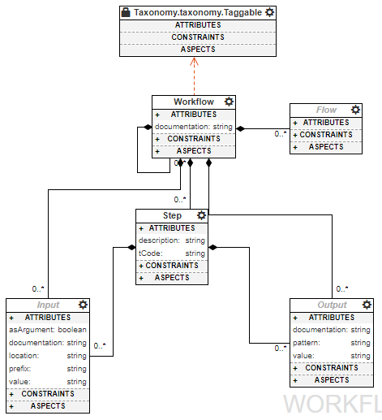

The Common Workflow Language modeling language
==============================================

The goal
________

By developing this visual domain to allow the modeling of CWL workflows 
we hope to bring the complexity of the language to a bearable level (albeit 
the complexity depends on the actual steps one uses). It also allows better 
reuse of components, easier composition of workflows and an overall smoother 
user experience. Leveraging the immense integration potential of the used WebGME 
framework will also allow us to develop checks that would ensure a near 
error-free development.

The main concepts
_________________

   
   Main building blocks of the model language of common workflow language

In a nutshell, the goal of the CWL language is to allow the description of 
repretable command executions with proper environment setting. To achieve this 
there is only a few basic concepts that needs to be understood:
- **Step** is the atomic element that describes the execution of a command. It
  is capable of describing a command on the hosting machine or an execution in a 
  virtualized environment (like docker).
- **Workflow** is the main container that describe a set of *steps* to be executed.
- **Inputs** and **Outputs** are defining the artifacts that are used during 
  the exectution of a *step* or *workflow*. These artifatcs can be varied, but the
  main ones are files and directories. While the CWL language differentiates 
  inputs and outputs of steps and workflows, as most of their attributes are 
  similar, our visual modeling language handles them equivalently.
- **Flow** while not explicitly defined as a concept in the CWL, the flow is 
  basically the directive that connects *outputs* to certain *inputs*. Our flow
  definition allows the user to visually connect *step* boxes and define the 
  flow of data that way. This concept is indeed important as in concrete 
  implementations of the CWL, it drives the scheduling of steps and therefore
  the whole execution of a workflow.
- **Sub-workflow** due to the features of the meta-modeling language of WebGME 
  our domain implementation does not define this concept (nor does the CWL), but
  it is important to mention as this is one of the most imporant pillars of
  workflow composition. A subworkflow is basically a regular workflow, that is
  getting used as a step inside another workflow. This hierarchical nature 
  allows the CWL to be able to capture more complex sequences of tasks without
  introducing unnecessary complexity for the description of the actual 
  commands.
- **Taggable** is a concept inherited from the Taxonomy Design Studio. It is
  used as an interface and allows us to define which parts of our language 
  should be able to hold taxonomy information. Currently only the workflow holds
  such connection, but later we intend to add this interface to the ports so
  that their flow connections can be verified and constrained by the user.