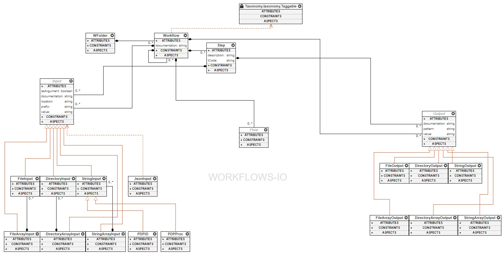

The Common Workflow Language modeling language
==============================================

The goal
________

By developing this visual domain to allow the modeling of CWL workflows 
we hope to bring the complexity of the language to a bearable level (albeit 
the complexity depends on the actual steps one uses). It also allows better 
reuse of components, easier composition of workflows and an overall smoother 
user experience. Leveraging the immense integration potential of the used WebGME 
framework will also allow us to develop checks that would ensure a near 
error-free development.

The main concepts
_________________

 